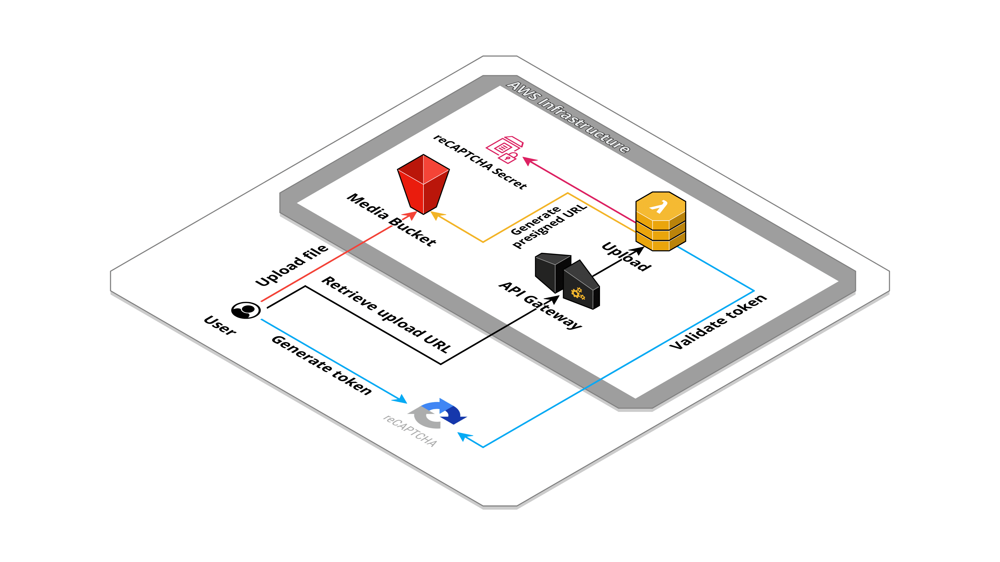
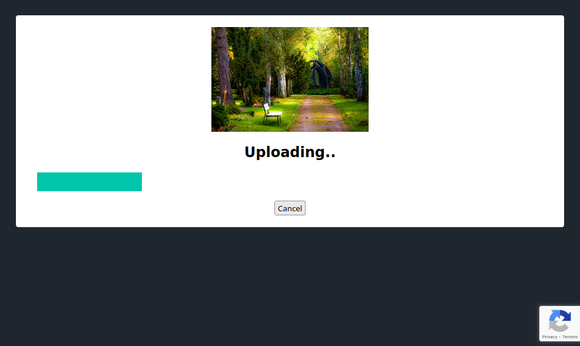

# S3 Public Upload Manager


A public uploader manager API to integrate in product personalization or checkout flow. Use [Google reCAPTCHA](https://www.google.com/recaptcha/about/) to protect the upload request against fraud and abuse.

## Created resources

This application will create an S3 bucket for uploaded file storage, an API Gateway endpoint to handle API requests and a Lambda function connected to it. Also a SSM Parameter is created to store Google reCAPTCHA secret key.



## Installation

| Region       | Deploy Link |
| ------------ | ----------- |
| eu-west-1    | [](https://eu-west-1.console.aws.amazon.com/cloudformation/home#/stacks/create/review?templateURL=https://bitbull-serverless-templates-butoamoogh8eigo.s3.eu-west-1.amazonaws.com/s3-public-upload/template.yml&stackName=s3-public-upload) |
| eu-central-1 | [](https://eu-central-1.console.aws.amazon.com/cloudformation/home#/stacks/create/review?templateURL=https://bitbull-serverless-templates-saijuozaeshae6e.s3.eu-central-1.amazonaws.com/s3-public-upload/template.yml&stackName=s3-public-upload) |
| us-east-1    | [](https://us-east-1.console.aws.amazon.com/cloudformation/home#/stacks/create/review?templateURL=https://bitbull-serverless-templates-chai7ephae5eet2.s3.us-east-1.amazonaws.com/s3-public-upload/template.yml&stackName=s3-public-upload) |
| us-east-2    | [](https://us-east-2.console.aws.amazon.com/cloudformation/home#/stacks/create/review?templateURL=https://bitbull-serverless-templates-xae9och1eipiem8.s3.us-east-2.amazonaws.com/s3-public-upload/template.yml&stackName=s3-public-upload) |

Using the [SAM CLI](https://docs.aws.amazon.com/serverless-application-model/latest/developerguide/what-is-sam.html):
```bash
sam build
sam deploy --guided
```

Including in an other SAM template:
```yaml
AWSTemplateFormatVersion: '2010-09-09'
Transform: AWS::Serverless-2016-10-31

Resources:
  S3PublicUpload:
    Type: AWS::CloudFormation::Stack
    Properties:
      TemplateURL: # pick a templates links from section below, based on your region
      Parameters:
        GoogleReCaptchaSecret: "xxxxxxxxxxxxxxxxxxxxxxxxxxxxxxx"
        UploadUrlExpiration: 3600
        AllowedOrigins: "*"
```

## Public templates

| Region       | Template URLs                                                                                                    |
| ------------ | ---------------------------------------------------------------------------------------------------------------- |
| eu-west-1    | https://bitbull-serverless-templates-butoamoogh8eigo.s3.eu-west-1.amazonaws.com/s3-public-upload/template.yml    |
| eu-central-1 | https://bitbull-serverless-templates-saijuozaeshae6e.s3.eu-central-1.amazonaws.com/s3-public-upload/template.yml |
| us-east-1    | https://bitbull-serverless-templates-chai7ephae5eet2.s3.us-east-1.amazonaws.com/s3-public-upload/template.yml    |
| us-east-2    | https://bitbull-serverless-templates-xae9och1eipiem8.s3.us-east-2.amazonaws.com/s3-public-upload/template.yml    |

## Parameters

This application need some required parameters when you deploy it:

- **GoogleReCaptchaSecret**: The Google reCAPTCHA secret key.

Optional parameters:

- **UploadUrlExpiration**: Number of seconds until the pre-signed URL expires (default 3600).
- **AllowedOrigins**: The AllowedOrigins CORS header (default: '*').
- **DefaultFileContentType**: The default content type per uploaded files (default: 'application/pdf').
- **DefaultFileExtension**: The default extension for uploaded files (default: '.pdf').

## Outputs

- **UploadBucket**: The name of S3 bucket where files will be uploaded to.
- **ApiUploadEndpoint**: The upload API endpoint URL.

## API Usage

**POST** `/upload`

request:
```js
{
  token: "xxxxxxxxxxxxx", // the token generated on frontend by reCAPTCHA lib
  type: "image/jpeg", // the object mimetype to allowed for upload (leave empty to use the default value)
  ext: ".jpg" // the file extension (leave empty to use the default value)
}
```

response:
```js
{
  key: "e275aa35-54c2-42ee-a10c-9d6a598ed722.jpg", // the random object key
  type: "image/jpeg", // the object mimetype allowed for upload
  url: "https://...." // the presigned URL to use for upload
}
```

errors:
- 404: API route not found, invalid URL path
- 400: Invalid POST request data provided
- 403: Invalid reCAPTCHA token provided (invalid host, score..)

## Using the upload URL

Check the AWS documentation about [Uploading objects using presigned URLs](https://docs.aws.amazon.com/AmazonS3/latest/userguide/PresignedUrlUploadObject.html) for infos and examples.

## Frontend example

Edit the file `frontend/index.html` before using locally or serving it remotely:

Add the Google reCAPTCHA site key (not the secret one) to API lib include script:
```html
<script src="https://www.google.com/recaptcha/api.js?render=<insert the reCAPTCHA key here>"></script>
```
and at the top of main script:
```js
const RECAPTCHA_SITE_KEY = '<insert the reCAPTCHA key here>'
```

Change the `API_ENDPOINT` variable adding the Stack output `ApiUploadEndpoint` value:
```js
const API_ENDPOINT = '<insert the API endpoint here>'
```



Here a collection of some example jpg files: https://sample-videos.com/download-sample-jpg-image.php

## Credits

- Starting from AWS example [aws-samples/amazon-s3-presigned-urls-aws-sam](https://github.com/aws-samples/amazon-s3-presigned-urls-aws-sam)
- Repository badges by [Shields.io](https://shields.io/)
- Infrastructure schema by [Cloudcraft](https://www.cloudcraft.co/)
